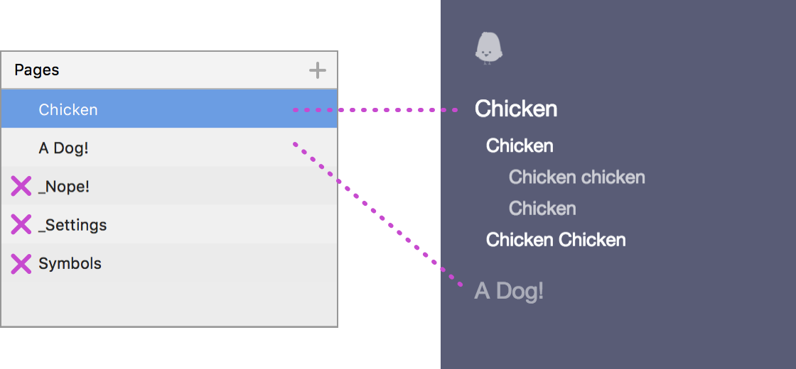

# Sketch Design Doc :chicken::dog:
This plugin exports a simple website using a bunch of conventions and the Sketch document as the structure. We named the plugin "design doc" because initially, we used it to export a design guideline, but we have been using it for many other things.

If you want to see an example, you can build [this website](http://mamuso.github.io/sketch-designdoc/Chicken/Chicken/) using this [Sketch file](https://github.com/mamuso/sketch-designdoc/raw/master/examples/Chicken/Chicken.sketch) as a base.

## How to Install
1. Download and open [```sketch-designdoc-master.zip```](https://github.com/mamuso/sketch-designdoc/archive/master.zip)
2. Open ```DesignDoc.sketchplugin```
3. Done! :dancer:

## How it works
The plugin scans the document and builds a page following these rules:

### Pages => Menu
The order of the pages is the order of the menu. The plugin generates a ```index.html``` page that redirects to the first element of the menu.



- The plugin ignores the "Symbols" page.
- If the name of the page starts with an underscore "_" the plugin ignores the page.
- "_Settings" is a special case.

## TODOs and Known Issues
- The output is not mobile friendly (yet)


